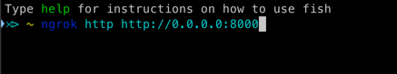
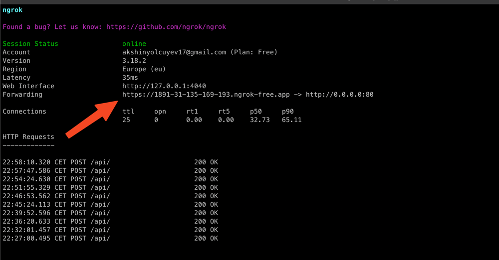
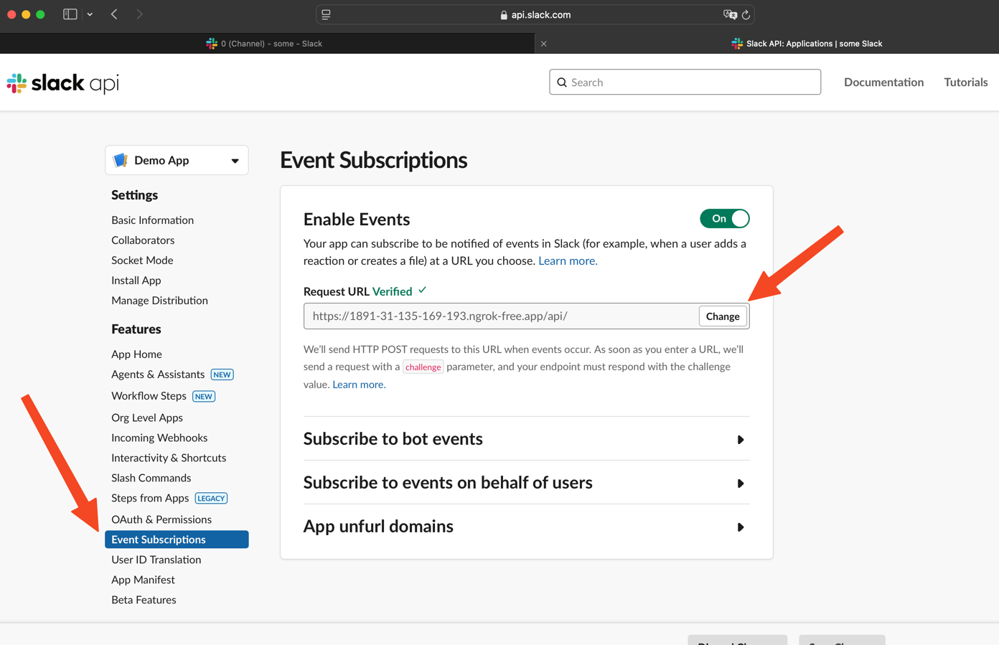
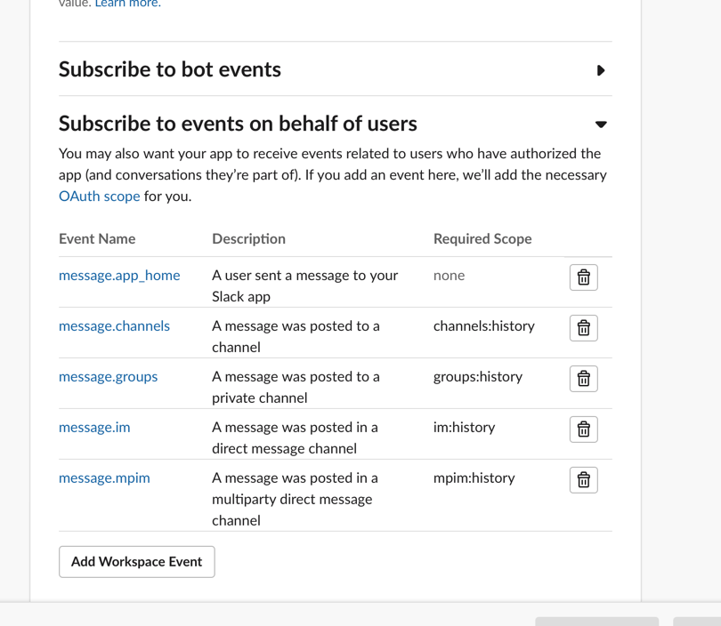

# DLP CheckPoint Task

## Description
Brief description of project.

## Prerequisites
- Docker
- Docker Compose
- Ngrok
- Gunicorn
- Redis
- MySQL
- Python 3.11
- Poetry

## Setup

### 1. Clone the repository
```bash
git clone https://github.com/akshin18/CheckPoint-Task.git
cd CheckPoint-Task
```

### 2. Add the environment variables
```bash
File name: prod.env
```
### File example:
```
DATABASE_NAME=admin
DATABASE_USER=admin
DATABASE_PASSWORD=admin
DATABASE_HOST=db
DATABASE_PORT=3306

MYSQL_ROOT_PASSWORD=admin

DJANGO_SUPERUSER_USERNAME=admin
DJANGO_SUPERUSER_EMAIL=admin@admin.com
DJANGO_SUPERUSER_PASSWORD=admin

REDIS_HOST=redis
REDIS_PORT=6379
REDIS_DB=1
QUEUE_NAME=slack_queue
PATTERNS_URL=http://web:8000/api/get_patterns/
UPDATE_MESSAGE_URL=http://web:8000/api/update_message/
DEBUG=0
```

### 3. Build the project with Docker Compose
```bash
docker-compose up --build -d
```

### 4. Connect Slack

#### You have to connect Slack Event Subscription:
### NOTE: You have to use Ngrok for this step

### And paste the URL from Ngrok to the Request URL field



#### Do not forget to add message event:


### 5. Start Django server

#### Go to the web container
```bash
http://127.0.0.1:80/admin
```
#### And write credentials from the prod.env file


### 6. When you are in the admin panel, you have to add the patterns


### As a result when you try to send a message in Slack, the bot will check the message for patterns and if it finds any, it will set the message to the pattern with Lake , then you can find it in the admin panel